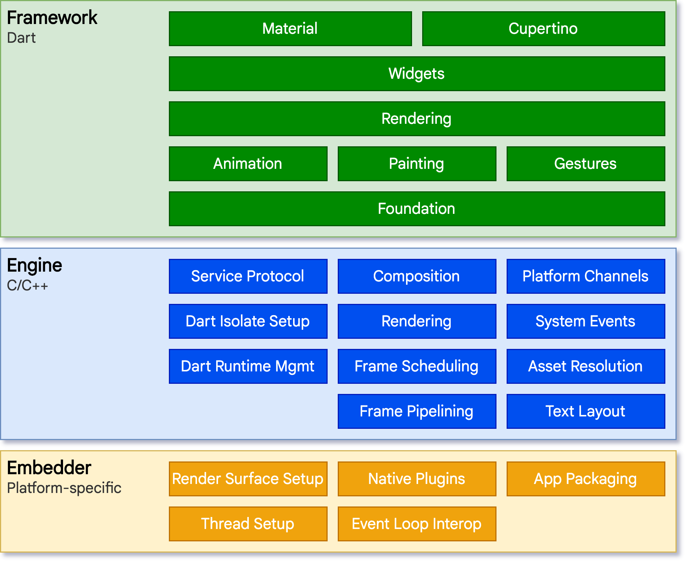
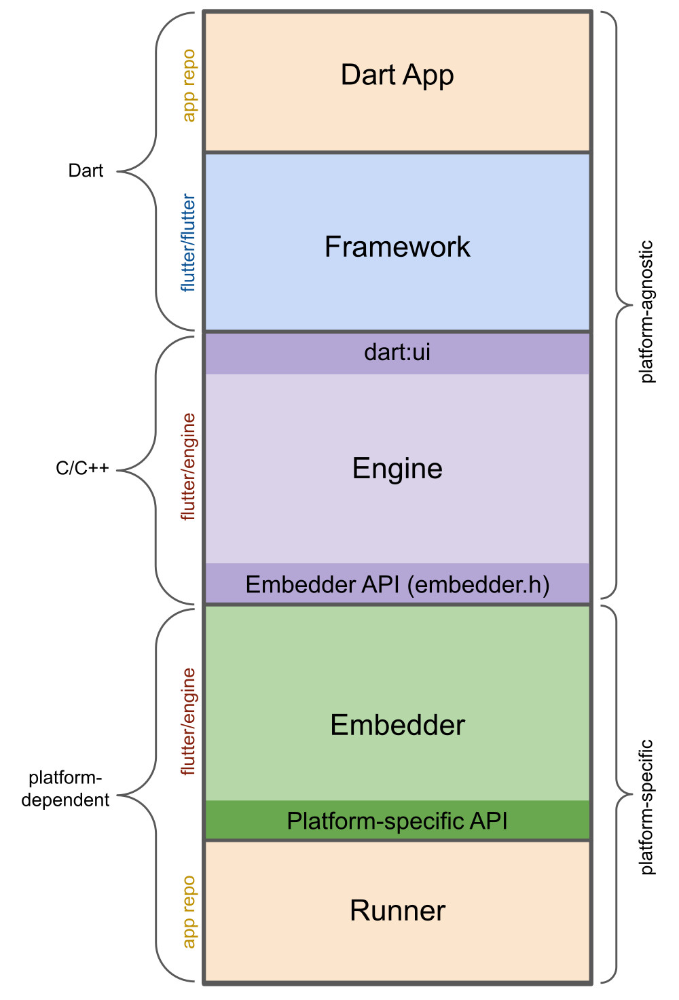
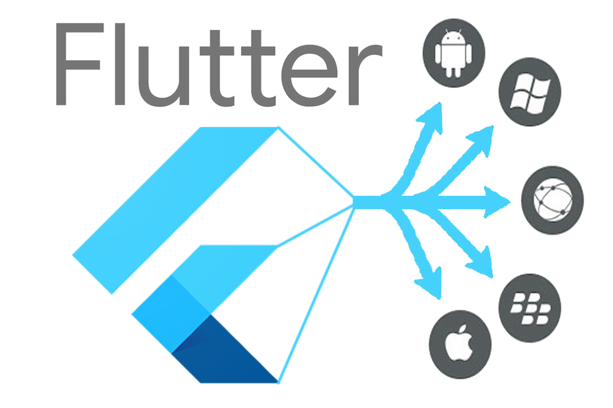

# Page and link download(网页及链接下载)

# 软件架构

- rust实现异步HTTP请求，基于async-std和async-tls(用于支持HTTPS)提供的套接字  
  实现的功能有：
    - HTTP1.0
    - GET请求
    - 301自动重定向并设置最大重定向次数
    - 支持HTTPS

- flutter-rust-bridge实现rust和dart通信  
  特性：
    - rust和dart无缝互操作
    - dart调用异步rust
    - 错误跨语言传递

- dart实现的仿python scrapy爬虫框架  
  实现的功能：
    - 自动处理网络请求失败等异常情况
    - HTTP请求自动去重
    - 异步发送队列中的请求
    - 自动处理非法链接、外链、相对链接等情况

- dart实现的爬虫，用于实现核心功能：网页及链接下载  
  实现的功能
    - 使用xpath解析HTML中的超链接、script引用、CSS引用、图片、视频、音频以及部分预加载资源
    - 解析CSS中引用的图片资源
    - 使用xpath精准定位链接并重写成相对路径

- flutter实现的UI，展示下载过程  
  实现的功能
    - 动态绘制力导向图，形象展示网站结构
    - 动态修改力导向图的斥力和引力，能调整力导向图布局
    - 与爬虫框架通过消息传递机制通信，实现安全的并发

# 详细说明

## rust

rust是一个内存安全、并发安全、高性能的系统编程语言，有许多零开销抽象(zero-cost abstractions)
，并有无空值、无GC等高级特性  
同时rust还支持多种平台，可以编译成多种平台的目标文件  
async-std是一个异步标准库，提供了异步的网络IO等功能，本项目依赖async-std提供的`TcpStream`实现异步读写socket，
使用async-tls提供的`TlsConnector`实现了TLS层

## flutter-rust-bridge

flutter-rust-bridge是一个flutter的一个第三方库，它提供了dart和rust之间的无缝互操作的特性，而且rust也能编译成各个平台的目标文件，
满足flutter的跨平台特性  
rust实现IO、计算等繁重任务，dart实现UI、逻辑等轻量任务，两者之间通过flutter-rust-bridge进行通信  

## dart实现的仿python scrapy爬虫框架

主要参考了python scrapy的设计，采用了广度优先的树遍历算法，允许使用类似声明式的方式描述爬虫逻辑，而自动去重、异常处理等功能则是框架内部实现的

## dart实现的爬虫

使用了两个网站进行测试

1. 我的个人博客 https://blog.virtualfuture.top/
2. vue的官方网站 https://vuejs.org/

这两个网站的特点是静态资源多，动态加载的资源较少，下载后的预览效果比较好
使用xpath精准提取HTML中的链接，包括

- `//link/@href` CSS引用、网站图标、预加载资源等
- `//script/@src` JS引用
- `//img/@src`     图片
- `//audio/@src`  音频
- `//video/@src`  视频
- `//a/@href`    超链接

此外还使用了正则表达式提取CSS中通过`url()`引用的外部资源，包括图片、字体等

## flutter实现的UI

flutter是Google推出的跨平台UI框架，使用dart语言

参考flutter的第三方库`graphview`，实现了力导向图的绘制，根据节点的度动态调整节点的大小和颜色，允许用户动态调整力导向图的绘制参数，以获得更好的展示效果

### 力导向图的绘制

原理是将每一节点看作电荷，每一条边看作弹簧，电荷是同性的所以相互排斥提供斥力，弹簧长度大于平衡长度所以提供引力  
斥力使得每一个节点相互远离，而引力使得通过边相连的节点相互靠近，当系统达到能量最低的状态时，有关系的节点汇聚在一起，
无关系的节点远离

使用flutter官方favor的`provider`管理状态，`provider`是基于`InheritedWidget`
的薄封装，消除了很多繁琐代码的同时保持了flutter局部刷新的特性

### 与爬虫框架的通信

虽然爬虫框架调用了rust的异步HTTP请求，但解析HTML，CSS等操作仍然会耗费大量CPU时间，flutter推荐任务大于200ms时应该使用Isolate

Isolate是dart的并发概念，相当于线程，但是Isolate之间无法共享内存，只能通过消息传递机制进行通信。每个Isolate都有自己的事件循环，
Isolate之间由于无法共享内存，所以不会出现数据竞争等问题，几乎不需要基于锁的同步机制，并发性能高而且避免了使用锁带来的隐性问题

dart的Isolate符合go的设计理念：**"Don't communicate by sharing memory; share memory by
communicating."**

## 使用flutter的原因

1. dart是一门特性齐全的现代语言，异步、并发、空值安全等设计理念现代，同时还能够AOT编译成多个平台的目标文件，性能接近原生而且跨平台
2. flutter能够运行在web,android, ios, windows, macos, linux等多个平台，同时参考了react的设计理念，组件化、声明式
   等优良设计，以及配套的hot reload、Inspector、Outliner等工具，提高了开发效率

